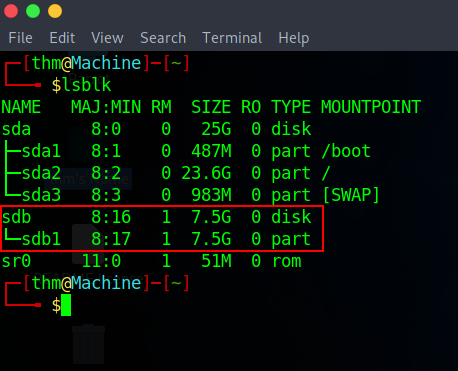
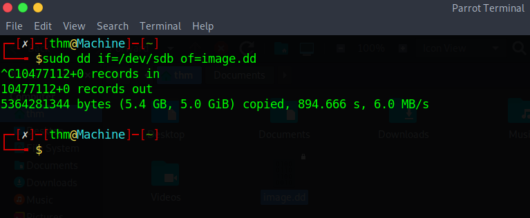
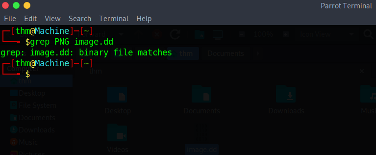
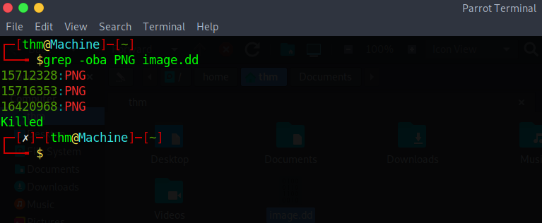
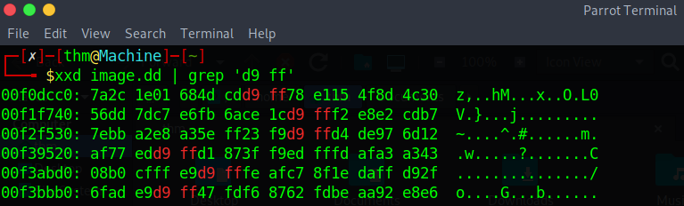

## Useful Links
#### 1. File Signatures Table
      https://sceweb.sce.uhcl.edu/abeysekera/itec3831/labs/FILE%20SIGNATURES%20TABLE.pdf

#### 2. Wikipedia List of File Signatures
      https://en.wikipedia.org/wiki/List_of_file_signatures

## Complete guide for recovery of a deleted file using cli

> **Note**: Some of the commands can take upto 15-20 minutes if using a virtual environment.

#### 1. Find the path of the USB drive by using.
      lsblk

#### 2. Create Forensic Image using dd command.
      sudo dd if=/dev/sdb of=image.dd

> ****Note:**** In my case, I have /sdb, you may have some other name e.g. /sdc

#### 3. Verify that ‘PNG’ files exist within the forensic image.
      grep PNG image.dd

> ****Note:**** I have used an image with png extension. You may have a jpeg, jpg or some other file type.

#### 4. Find the offset of ‘PNG’ file using the grep command along with ‘oba’ flag, to only output the matching part of the line and print the byte offset of each match. 

By testing each offset at last step, I find that the second one is the actual offset address of the file. Divide the number of bytes, 15716353, by 512, which is the number of bytes per sector, which gives approximately 30696 as the starting sector.

#### 5. Now use the xxd utility to get a hex dump of file and then pipe that into grep, to search for the two bytes we need, which are ‘ff d9’. But we search for ‘d9 ff’ as we are dealing with an intel system and such systems use little endian. Click here for [Endian Converter](https://blockchain-academy.hs-mittweida.de/litte-big-endian-converter/)

Do the same to the ending sector, after converting ‘00f3bbb0’ to decimal first, we get 17021872, that is 33245 sectors. 
<!--  -->
